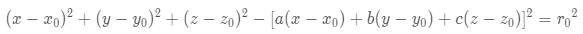
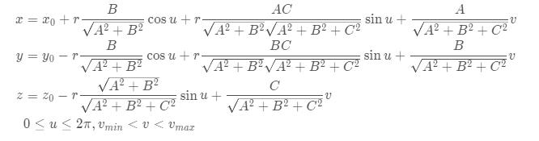
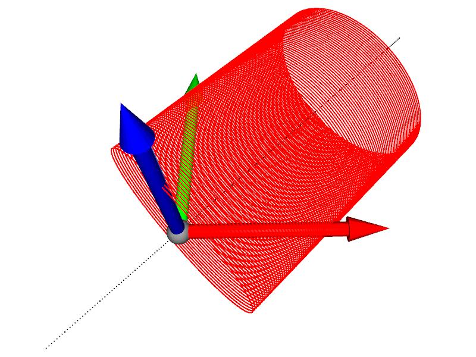
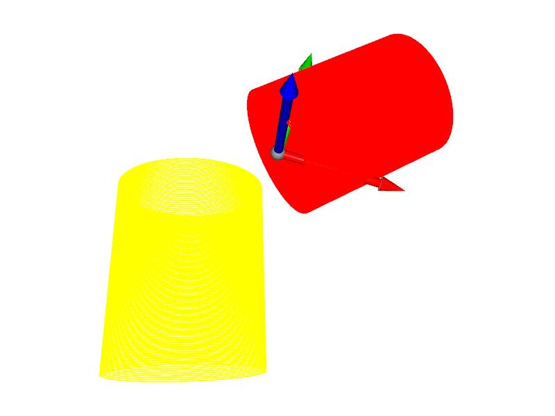

# create geometry point cloud
## cylinder
According to the geometric characteristics of a cylinder, we know the distance form a point 'P' on the cylinder surface to its axis is equal to the radius r0,
P0 (x0, y0, z0) is a point on the cylindrical axis, (a, b, c) is the cylindrical axis vector, and r0 is the radius of the cylindrical bottom circle.
The distance from any point on the cylindrical surface to its axis is radius r0, that is:




[https://blog.csdn.net/qq_30815237/article/details/90405087](https://blog.csdn.net/qq_30815237/article/details/90405087)

we can use this equation to fit a cylinder and get the 7 parameters(r,x0,y0,z0,a,b,c) of the cylinder

Alternatively, if we know the 7 parameters of a cylinder, we use its parametric equation to create a cylinder

the parametric equation of cylinder is:



[https://blog.csdn.net/inerterYang/article/details/111998278](https://blog.csdn.net/inerterYang/article/details/111998278)

## Pull the code
```bash
git clone https://github.com/Noel-Gallagher-Highflyingbirds/geometry.git
cd geometry
pip install reqirements
```

## test
```bash
python main.py
```



Also available at:
[https://blog.csdn.net/qq_41102371/article/details/121482141](https://blog.csdn.net/qq_41102371/article/details/121482141)

